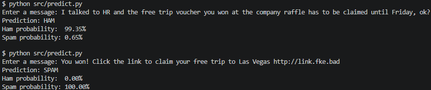

# SMS Spam Detection with Python

A machine learning project that classifies SMS messages as **SPAM** or **HAM** using `CountVectorizer` and `MultinomialNB` (Naive Bayes Algorithm).




## Why I Built This

After years developing RESTful APIs and backend systems for big corporations in Java/Springboot, I decided to step out of my comfort zone and start studying Python and Machine Learning.

A second big motivation for starting this project was, while applying to new roles, I frequently saw Python and Machine Learning the job descriptions. I decided to learn more practically, building something from scratch, and hopefully doing something exciting and challenging. SPAM is a problem I deal with a LOT, both in text messages and e-mails, so my goal was to explore this real-life problem.

## What I Learned

Through working on this project, I've learned the basics, the first steps on:

- Natural Language Processing (NLP)
- Text classification
- Training and testing machine learning models
- Understanding that training the model is more costly then making predictions
- Data leakage and why it must be avoided
- Feature extraction using `CountVectorizer`
- Using the Multinomial Naive Bayes library (still have to study the theory of the approach)
- Understanding and analyzing Precision, Recall, F1-score and Confusion Matrices
- The difference between model training and prediction
- How imbalanced datasets can output misleading accuracy results
- Comparing different approaches such as TF-IDF and n-grams
- Using model probabilities and decision thresholds

## A couple of initial results

The final model uses `CountVectorizer` + `MultinomialNB`.

On the test dataset, the model achieved:

| Metric | HAM | SPAM |
|---|---:|---:|
| Precision | 99% | 99% |
| Recall | 100% | 92% |
| F1-score | 99% | 95% |

Overall test accuracy: **98.74%**

The model correctly identified most spam messages, but still had a few false positives. Since implementation of different models is quick, I also tested TF-IDF and n-grams, but they increased the number of false positives during tests. Therefore, the simple `CountVectorizer` + `MultinomialNB` approach performed best on the used dataset.

## How to run the app

After cloning the repository, cd into the spam-detection-ml folder and:

### 1. Create and activate a virtual environment
```bash
python -m venv .venv

source .venv/Scripts/activate
```
### 2. Install dependencies
```bash
pip install -r requirements.txt
```
### 3. Train the model
```bash
python src/train.py
```

This will train the model and save the vectorizer and the model into the project.

### 4. Make predictions
```bash
python src/predict.py
```
Enter an SMS message (String) you'd like to be analyzed. The application returns the predicted class along with the estimated probability for each class.

Example:

    Enter a message: We are going to a concert tonight! Pick you up at 8?  

Output:
    
    Prediction: HAM
    Ham probability:  100.00%
    Spam probability: 0.00%

## Future Improvements

The current version works with manually entered SMS messages. 

The next version of the project will integrate with the Gmail API to:

- Retrieve emails from a Gmail account
- Collect user feedback on incorrect predictions, to help a periodic retraining using verified examples

## Dataset

UCI SMS Spam Collection